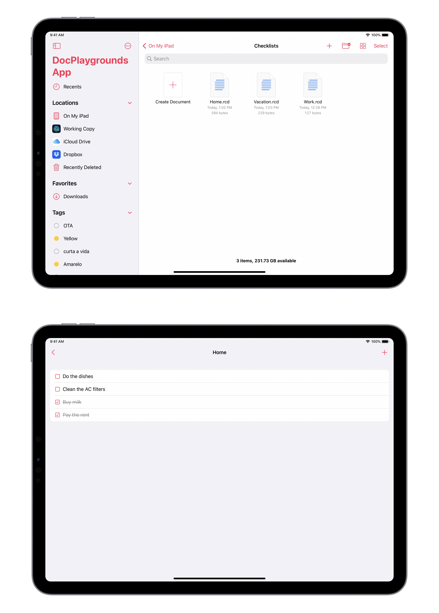

# A document-based SwiftUI app in Swift Playgrounds

This sample project demonstrates the creation of a document-based app in Swift Playgrounds 4 for iPad. It uses some tricks in order to declare the app's document type, which I have detailed in this blog post.

As mentioned in the blog post, consider this a temporary hack, and not something you should rely on for production apps.

